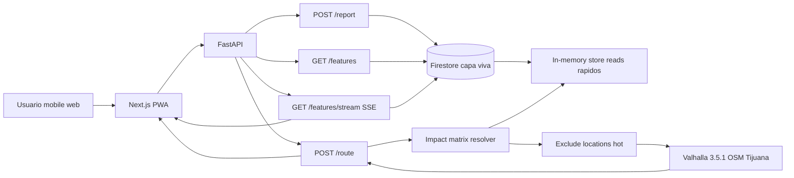

# Architecture — Senda

Senda is built on two data layers with different latency and durability goals. The live layer (Firestore) powers the citizen loop in real time; the routing layer (Valhalla) turns validated data into route costing behavior.

```
apps/web        Next.js 14 App Router — mapa, bottom sheet de ruta, reportes, accesibilidad
apps/api        FastAPI — /route, /features, /features/stream (SSE), /report
services/       Valhalla con tiles reales de Tijuana
data/seed/      Features sembradas (barreras y amenidades en Av. Revolucion)
docs/           SRS, arquitectura
```

## System Flow

```
Usuario abre el mapa → deja origen en "Mi ubicacion" o lo edita → escribe destino (texto o voz) → ajusta perfiles
  → API geocodifica → consulta features del bbox
  → matrix.resolve_effect (peor caso multi-perfil)
  → Valhalla route con exclude_locations para barreras B
  → mapa dibuja ruta + markers → bottom sheet resume ruta/pasos/barreras → TTS narra resultado

Ciudadano reporta barrera (foto + GPS)
  → POST /report → Firestore → SSE broadcast
  → haversine <80m de ruta activa + efecto=B
  → rerouteIfNeeded → vibracion haptica + banner visual + LiveRerouteToast
```

## Core Principle: TYPE vs EFFECT

A barrier has objective physical attributes (`surface_broken`, `ramp_missing`, etc.). A profile defines functional sensitivities. The routing cost is `matrix.resolve_effect(profiles, feature)`. The code never branches on profile name — adding a profile is a column, adding a barrier type is a row.

## Data Flow Diagram



## Contracts

### POST /route
```
Request:  { origin: str, destination: str, profiles: Profile[] }
Response: { coords: [lng,lat][], distance_m: number, eta_min: number,
            features_evitadas: MapFeature[], features_aprovechadas: MapFeature[], steps: Step[] }
```

### POST /report
```
Request:  multipart (image?, voice_text?, lat, lng, kind, subtipo)
Response: MapFeature
```

### GET /features
```
Query:    ?bbox=swLng,swLat,neLng,neLat&kind=barrier|amenity|transport|crossing
Response: GeoJSON FeatureCollection
```

### GET /features/stream (SSE)
```
Events:   initial (all features), ready, new_feature
Keepalive: : keepalive\n\n cada 30s
```

## Key Decisions

- **GeoJSON order**: coords always `[lng, lat]` toward the map, never `[lat, lng]`.
- **Worst-case multi-profile**: any `B` among active profiles → `exclude_locations`. `D` → high penalty. `L` → low penalty.
- **Seed path in Docker**: `features_seed.json` lives outside `apps/api/`. In production, Firestore is the source of truth.
- **Valhalla in Cloud Run**: tiles baked into the Docker image. `min-instances=1` to avoid cold starts during demo.
- **SSE keepalive**: 30s heartbeat to keep proxy connections alive.
- **Exclude padding**: features within 40m of origin/destination are excluded from exclusions to preserve Valhalla snapping.

## Active Deployments

| Service | URL | Runtime |
|---|---|---|
| Frontend | Vercel | Next.js 14, Bun |
| API | `https://senda-api-131553755517.us-central1.run.app` | Cloud Run, FastAPI |
| Valhalla | `https://senda-valhalla-131553755517.us-central1.run.app` | Cloud Run, min-instances=1 |
| Firestore | Proyecto `sendamx`, coleccion `features` | 8 features activas |

## Stack Summary

| Layer | Technology |
|---|---|
| Frontend | Next.js 14, TypeScript, Tailwind, Zustand, Google Maps JS |
| Accessibility | Web Speech API, speechSynthesis, Vibration API, ARIA |
| Backend | FastAPI, pydantic v2, Python 3.12 |
| Routing | Valhalla 3.5.1 with OpenStreetMap Tijuana |
| Database | Firestore (live layer) + in-memory store (fast reads) |
| Deploy | Cloud Run (API + Valhalla), Vercel (web) |
