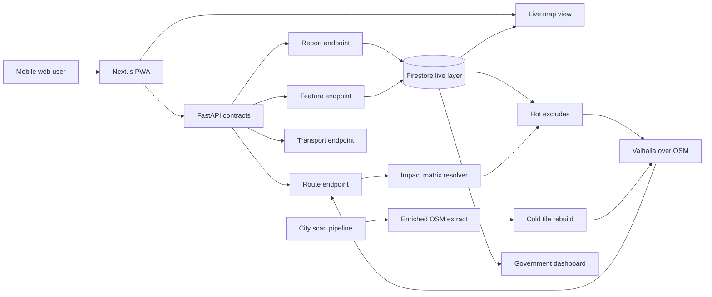

# Architecture

Senda uses two map layers with separate latency and durability goals. The live layer powers the citizen loop immediately; the routing layer turns validated data into Valhalla routing behavior.

## Contracts

- The web shell calls typed API functions that currently return shaped mock data.
- FastAPI endpoints return mock responses and expose stub modules for external integration work.
- Valhalla, Firestore, Gemini, Street View, and analytics calls are represented by typed boundaries only.
